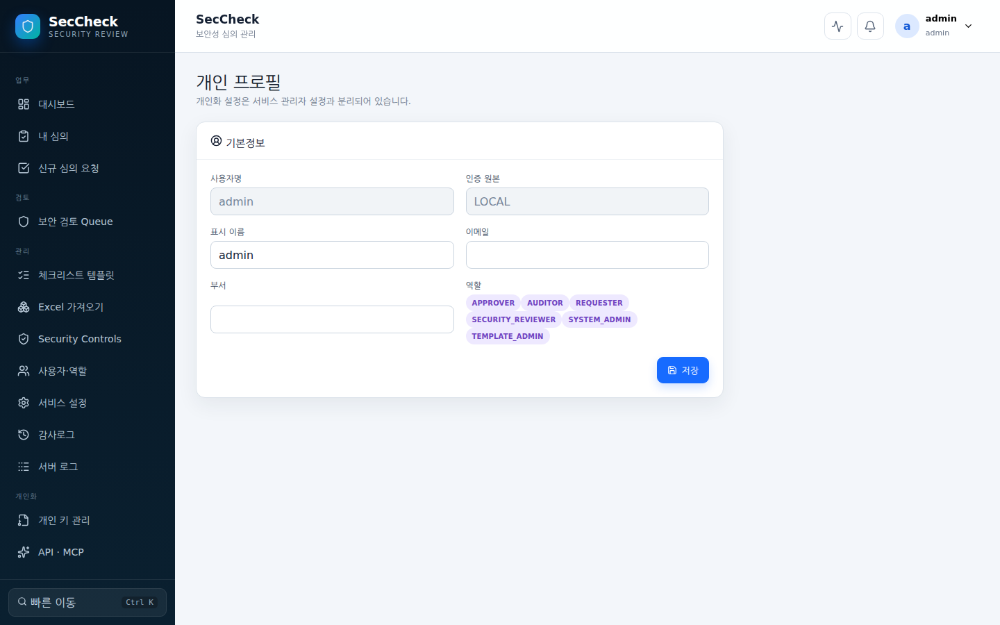
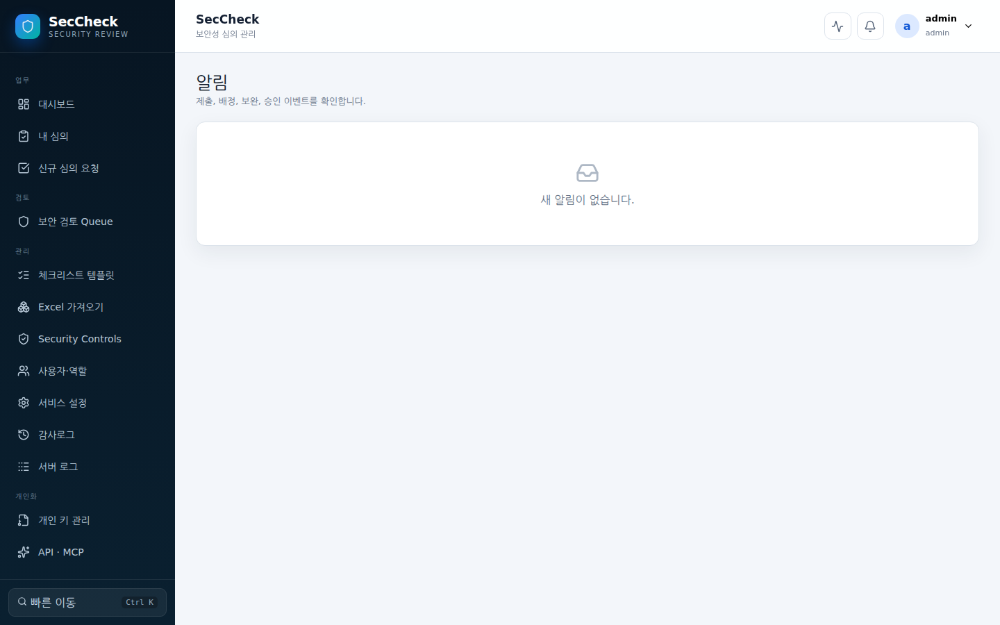
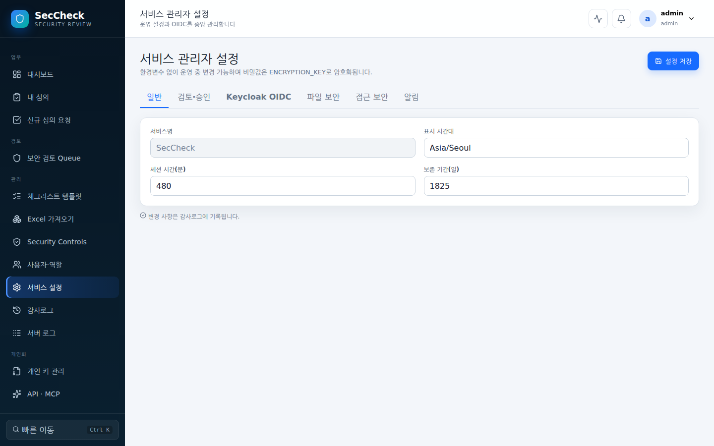
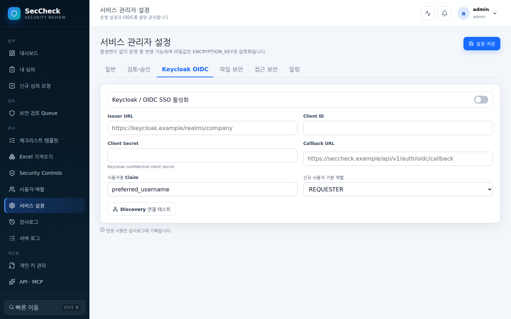
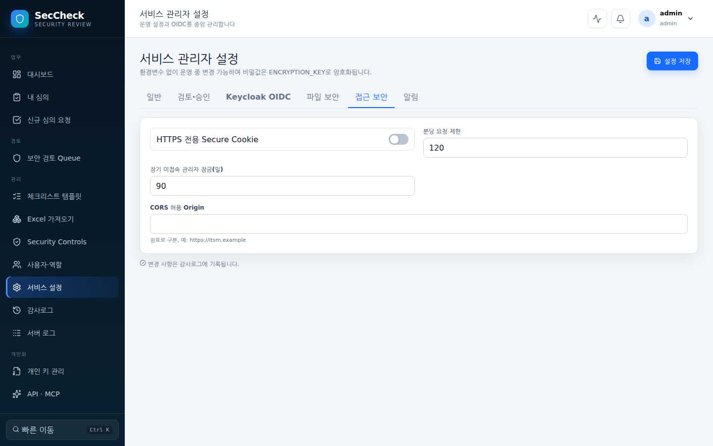
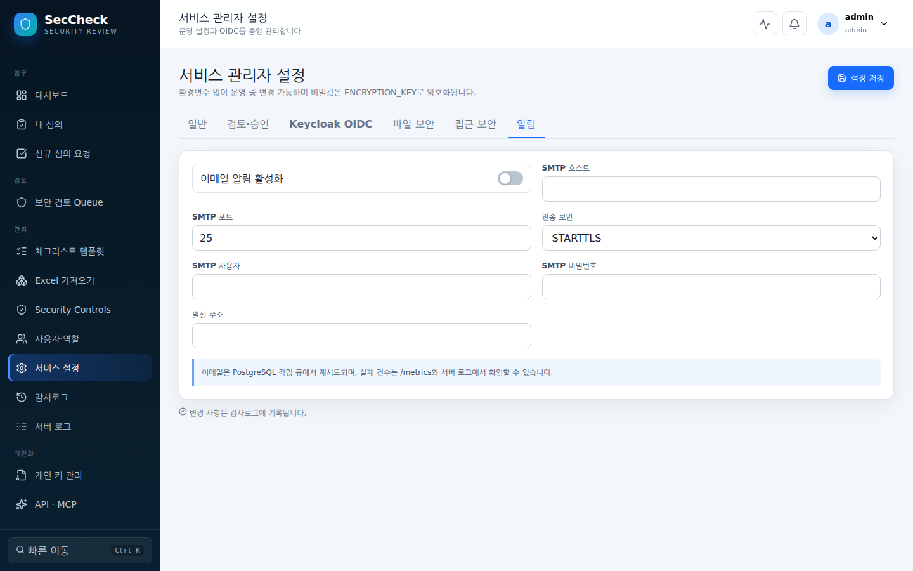
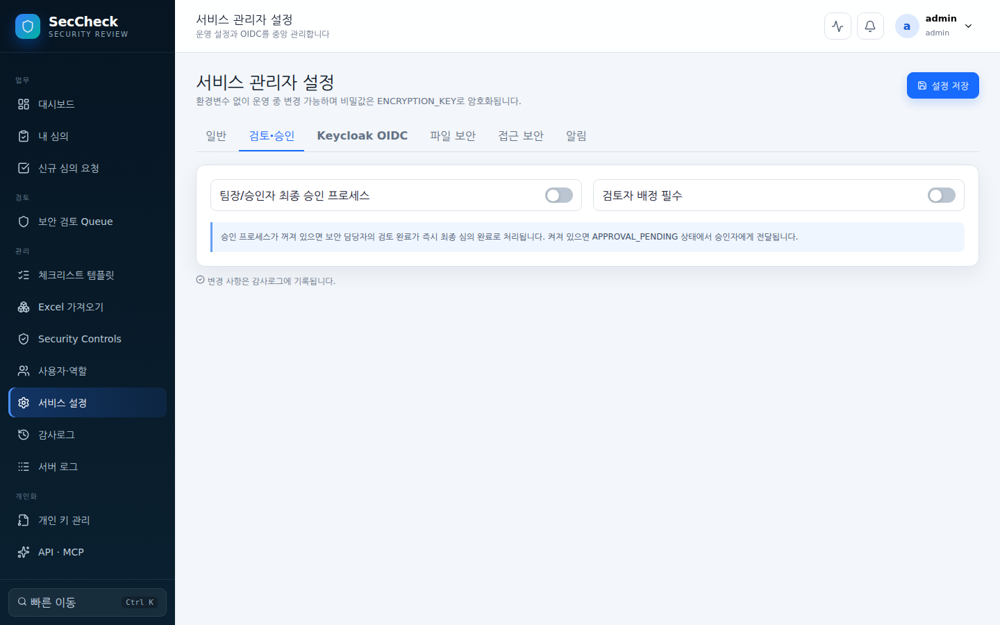
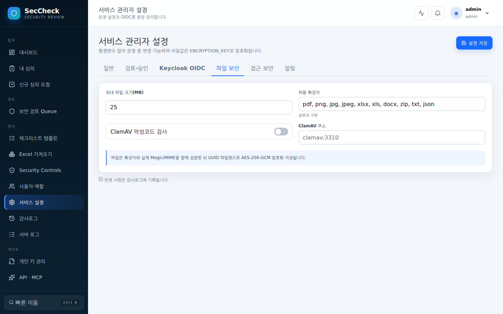

# SecCheck 기능 및 화면 가이드 (Features & UI Guide)

`SecCheck`는 Excel 기반 보안성 심의 업무를 템플릿·버전·제출 스냅샷·항목별 검토로 체계화한 **엔터프라이즈 오프라인 운영형 보안 검토 플랫폼**입니다.

---

## 📸 전체 메뉴별 주요 화면 및 기능 명세

### 1. 인증 및 로그인 (`/login`)

- **로컬 부트스트랩 관리자**: 초기 4대 환경변수(`BOOTSTRAP_ADMIN`, `BOOTSTRAP_ADMIN_PASSWORD`) 기반 보안 로그인
- **Keycloak OIDC SSO**: 설정 시 `사내 SSO로 로그인` 버튼을 통한 통합 인증 연동
- **서비스 브랜드 & 버전**: 현재 릴리스 버전(`v0.1.0`) 및 서비스명 실시간 표시

---

### 2. 보안 심의 대시보드 (`/`, `/dashboard`)

- **내 후속조치**: 이행해야 할 후속조치를 심의 전체에서 모아 표시. 기한 초과와 확인 대기 상태를 구분하며, 리포트를 열 수 없는 요청자도 자기 조치 목록을 확인 가능
- **내 담당 항목**: 나에게 배정된 체크리스트 항목을 심의를 가로질러 모아 심의별 배정·미작성·보완 필요 건수로 표시. 심의번호를 누르면 그 심의가 `내 담당 항목` 필터가 켜진 상태로 열립니다. 남은 작업이 없는 심의는 목록에서 사라집니다
- **핵심 KPI 현황 카드**: 진행 중 심의(Active), 신규 검토 대기/미처리 보완 요청(Pending), 14일 내 오픈 예정, 심의 완료 통계 오픈 예정 카드에는 그중 **심의가 끝나지 않은 건수**가 함께 표시되어, 검토가 완료되지 않은 채 열릴 서비스가 몇 건인지 바로 보입니다. **각 카드를 누르면 그 숫자에 해당하는 심의 목록**이 열립니다.
- **대시보드의 범위 = 목록의 범위**: 카드의 숫자는 모두 그 숫자에 해당하는 심의 목록을 여는 링크이므로, 세는 범위와 열 수 있는 범위를 같은 규칙으로 맞춥니다. 전체 심의를 보는 것은 보안 담당자·감사이고, 시스템 관리자(그 역할만 가진 경우)의 대시보드는 본인 업무를 보여 줍니다. 조직 전체 현황은 리포트에서 봅니다
- **대기열 상태**(보안 담당자·감사): 담당자가 없는 심의와 3일 이상 멈춘 심의 수를 보여 주고 같은 조건의 목록으로 연결합니다. 정체 판정 기준(기간과 상태)은 `심의 정체` 알림과 한 곳에서 공유하므로 화면의 숫자와 메일이 어긋나지 않습니다.
- **최근 심의 테이블**: 최근 요청된 심의의 심의번호, 서비스명, 상태, 오픈 예정일 요약
- **업무 흐름 가이드**: 서비스 정보 입력 → 체크리스트 작성·증적 → 검토·보완·재제출 → 승인·결과 보존 4단계 Snapshot 프로세스 안내

---

### 3. 보안성 심의 목록 (`/reviews`)

- **다차원 실시간 검색 & 필터링**: 심의번호, 서비스명, 담당 부서 키워드 검색 및 상태 필터(작성 중, 제출 완료, 재제출, 검토 중, 보완 요청, 승인 대기, 심의 완료, 반려)
- **신규 심의 요청**: 상단 `신규 심의` 버튼을 통한 즉시 요청 생성

---

### 4. 신규 보안성 심의 요청 (`/reviews/new`)

- **서비스 기본정보**: 서비스명, 담당 부서, 서비스 설명, 서비스 유형(대내/대외/관리자/배치), 신규·변경 구분, 구축·개발·운영 담당자, 오픈 예정일, 업무 중요도
- **Rule Engine 적용 조건**:
  - 관리자 페이지 존재, 개인정보 처리, 개인신용정보 처리, 외부 고객 서비스, 클라우드 사용, Docker 사용, Kubernetes 사용, 외부기관 연계, 인터넷 통신 여부
- **지능형 스냅샷 자동 배정**: 폼 제출 즉시 Rule Engine이 조건에 부합하는 게시 템플릿의 항목들을 불변 스냅샷으로 배정

---

### 5. 심의 상세 & 체크리스트 작업 공간 (`/reviews/:id`)

- **작성 진행률 & 검토 집계 바**: 총 항목 대비 작성률(%), 적합/조건부/미흡/N/A 집계 실시간 표시
- **빈 화면과 실패한 화면의 구분**: 목록을 불러오지 못하면 빈 목록이나 무한 로딩이 아니라 `화면을 불러오지 못했습니다`와 원인, `다시 시도` 버튼을 보여 줍니다
- **검색 결과 안내**: 통합 검색은 종류별 20건까지 보여 주고, 더 있으면 "더 많은 결과가 있습니다"를 함께 표시해 찾는 대상이 목록 밖에 있을 수 있음을 알립니다
- **대시보드 카드 상한 안내**: `내 차례`·`보완 조치 기한`·`내 후속조치`·`내 담당 항목`은 12건까지 표시하며, 더 있으면 `12건만 표시`라고 밝힙니다
- **검색 대상**: 심의번호·서비스명·부서·템플릿명과 함께 신청자·구축·개발·운영 담당자·검토자·승인자의 이름으로 찾습니다. 항목은 항목코드·보안요건·질문뿐 아니라 **작성자가 쓴 답변(현재 상태·조치 계획·N/A 사유)과 검토 의견 본문**까지 찾습니다. 어디에서 걸렸는지(`답변`/`검토 의견`)와 해당 문장을 결과 줄에 함께 보여 주고, 항목 결과를 누르면 그 항목이 펼쳐진 채로 심의가 열립니다. 볼 수 있는 심의의 내용만 검색됩니다.
- **접근성**: 저장·실패 알림(토스트)과 로딩 표시가 보조기술에 전달됩니다(`aria-live`, `role`). 대화 상자는 열릴 때 포커스를 가져가고 Tab이 그 안에서만 순환하며 닫으면 원래 위치로 포커스를 돌려줍니다(`role="dialog"`, `aria-modal`). 모든 입력 항목의 라벨이 해당 컨트롤에 연결되어 있어 화면 낭독기가 이름을 읽고 라벨 클릭으로 포커스가 이동합니다. 도움말과 오류 문구도 컨트롤에 연결되어 함께 읽힙니다 체크리스트 항목은 행 오른쪽의 펼침 버튼으로 키보드에서도 열고 닫을 수 있으며(`aria-expanded`), 항목 편집기는 키보드로 이동만 해도 현재 항목으로 인식합니다.
- **오픈 임박 필터**: 오픈 예정일이 2주 이내인데 아직 끝나지 않은 심의만 추려 봅니다. 대시보드의 `미완료 N건`을 누를 때 보게 되는 목록과 같은 조건입니다
- **최종 결과 표시·필터**: 목록 행에 승인/조건부/반려를 함께 표시하고 `조건부 승인` 칩으로 걸러 봅니다. `result=` 파라미터로 여러 결과를 한 번에 지정할 수 있습니다
- **담당자 없음·정체 필터**: 대시보드의 `대기열 상태` 숫자와 **같은 조건**으로 목록을 걸러 봅니다. 숫자를 누르면 그 심의들만 남습니다.
- **1클릭 다중 포맷 내보내기**: `Excel (.xlsx)`, `PDF (.pdf)`, `ZIP` 결과물 즉시 다운로드
- **보존되는 기록의 범위**: Excel과 JSON에는 항목·답변·판정·증적 목록(파일명과 SHA-256)에 더해 **보완 요청 이력**(요청 사유·요청자·담당자·기한·상태·조치 내용)이 포함됩니다. 심의가 몇 번 오갔는지는 결론만큼이나 기록의 일부입니다
- **약속까지 포함한 결과물**: 항목별 판정과 함께 후속조치 내용·조치 기한·이행 보고일·이행 확인일이 JSON·Excel·PDF에 모두 실립니다. 조건부 적합의 조건이 결과물에서 빠지면 나중에 확인할 방법이 없습니다
- **섹션 네비게이션 & 항목 필터**: 템플릿/섹션별 빠른 이동 및 미작성, N/A, 증적 누락, 보완 요청, 코멘트 있음, 지적 항목(미흡·부적합·조건부·재확인) 필터, 판정 이후 답변이 바뀐 항목 필터. 필터 조건은 서버가 제출·완료 가드와 같은 규칙으로 판정해 내려줍니다
- **선택 항목 일괄 판정(검토자)**: 반복되는 판정을 한 번에 적용. 이미 판정한 항목은 건너뛰며 `덮어쓰기` 선택 시에만 교체. 최대 1000개, 검토 중(`REVIEWING`) 상태의 배정된 검토자만 가능
- **선택 항목 일괄 보완 요청(검토자)**: 같은 사유·기한·담당자로 여러 항목에 보완을 한 번에 요청합니다. 중복 요청은 건너뛰고 알림은 한 번만 발송합니다.
- **이월 답변 표시**: 재심의로 복사된 답변은 다시 저장하기 전까지 `이월 답변`으로 표시되고 필터로 모아 볼 수 있습니다. 정기 심의가 작년 답변을 그대로 통과시키는 것을 막습니다.
- **판정 이후 답변·증적이 바뀐 항목 감지**: 보완 요청은 심의 전체를 작성자에게 돌려보내므로 요청하지 않은 항목까지 수정될 수 있습니다. 판정보다 답변이나 증적(추가·새 버전·삭제)이 나중에 바뀐 항목은 `검토 후 답변 변경` 뱃지로 표시하고, 남아 있는 동안에는 검토 완료를 거부하며 몇 건이 남았는지 알려 줍니다. 판정은 자기가 판정한 답변·증적보다 이른 시각으로 기록되지 않으므로, 서버 시계가 뒤로 물러나도 재판정이 항상 지적을 해소합니다.
- **진행 경과**: 제출일·최종 제출일·승인일을 심의 상단에 표시. 화면에서 심의가 언제 이루어졌는지 확인 가능(기존에는 내보낸 파일에만 존재)
- **증적 업로더 표시**: 증적마다 첨부한 사람을 함께 표시해 여러 명이 작성하는 심의에서 책임 소재를 확인
- **다른 서비스의 판정**: 같은 항목 코드가 다른 서비스에서 어떻게 판정됐는지 최근 5건을 함께 보여 줍니다(보안 담당자·감사 전용). 같은 통제에 대한 판정 기준이 서비스마다 갈리는 것을 한 화면에서 확인
- **배정 이유 설명**: 항목마다 이 서비스의 특성 중 무엇이 적용 조건을 만족시켰는지(또는 수동 포함 사유가 무엇인지) 조건별로 보여 줍니다
- **이전 심의 증적 가져오기**: 같은 서비스의 지난 심의에 첨부된 증적을 항목 단위로 이 심의에 복사. 항목의 증적 첨부 영역에서 가져올 수 있는 파일이 있으면 먼저 알려 줍니다(이전 심의의 판정 여부와 무관). 파일은 원본 키로 복호화해 가져오는 사람의 키로 다시 암호화하며(증적 1건 = 키 1개 원칙 유지), 해시를 비교해 동일한 파일인지 확인합니다. 검사를 통과하지 않은 파일은 제외
- **이 서비스의 지난 심의**: 같은 서비스의 이전 심의를 상태·최종 결과·그때의 지적 건수와 함께 표에 모아 보여 줍니다(이름을 바꿔도 이어집니다)
- **결재 전 확인**(승인 대기): 지적 항목과 검토 의견, 승인 시 남는 후속조치와 기한, 미검증 보완 요청 수를 결재 버튼 위에 모아 표시. 기한 없는 후속조치는 별도 경고
- **심의 결론**: 최종 결과·최종 의견과 승인자의 결재 코멘트·일시를 심의 상단에 표시. 반려 사유를 요청자가 화면에서 바로 확인
- **제출 후 심의 취소**: 서비스 계획이 접히면 결정 전 어느 단계에서든 요청자가 사유와 함께 취소하고, 검토자·승인자에게 즉시 알립니다
- **반려 심의 보완 재개**: 반려된 심의를 담당 보안 담당자가 `보완 필요` 상태로 되돌려 같은 심의번호로 이어서 보완·재제출할 수 있게 합니다. 철회된 최종 결과는 지우고 반려 결정 이력은 남깁니다
- **결재 요청 회수**: 승인 대기 중인 심의를 담당 보안 담당자가 `검토 중`으로 되돌려 판정과 최종 의견을 다시 작성합니다. 승인자에게 회수 사유가 전달됩니다
- **두 번째 눈 보장**: 심의를 검토·판정한 사람은 같은 심의를 최종 승인할 수 없습니다. 그 심의는 다른 승인자에게 열리며, 1인 운영 설정을 켠 경우에만 예외입니다
- **담당자 지정 검증**: 검토자·승인자 칸에는 해당 역할을 가진 활성 계정만 넣을 수 있고, 같은 사람을 두 칸에 넣거나 신청자를 넣는 조합은 지정 시점에 거절합니다
- **검토 결과 열람**: 검토가 끝난 항목은 판정·검토 의견·후속조치·기한·이행 여부를 읽기 전용으로 표시. 편집 권한이 없는 참여자도 무엇이 왜 그렇게 판정되었는지 확인 가능
- **항목 순차 이동**: `항목 상세`의 위·아래 버튼 또는 `Alt`+`↑`/`↓`로 다음·이전 항목 이동. 현재 필터가 적용된 목록 순서를 따르며 `34 / 134`처럼 위치를 표시. 답변 입력 중에도 동작

---

### 6. 체크리스트 항목 편집 & 증적 암호화 업로드

- **적용 여부 & 자체 판단**: `Y`, `N`, `N/A` 원클릭 선택 및 적합/미흡 자체 평가
- **N/A 사유 & 현황 작성**: N/A 선택 시 필수 사유 입력 및 조치 계획 수립
- **실시간 자동 저장**: 타이핑 시 수초 내 백그라운드 자동 저장 및 상태 알림
- **증적 여러 건 동시 선택**: 파일 선택 시 여러 개를 한 번에 지정. 각각 별도 증적으로 저장되며, 일부가 정책에 걸려 실패해도 나머지는 그대로 저장됨 파일 선택창은 **허용 확장자만** 보여 주며, 최대 크기를 넘는 파일은 전송을 시작하기 전에 이유와 함께 거절합니다.
- **증적 첨부 (AES-256-GCM)**: 증적 파일 업로드 시 Magic/MIME 검증, SHA-256 해시 생성, 개인 데이터 키 버전 기반 AES-256-GCM 암호화 보관

---

### 7. 자동 배정 결과 수동 조정 (Rule Override)

- **규칙 예외 처리**: 서비스 특성에 따라 자동 배정된 항목을 제외하거나 미배정 항목을 수동 포함
- **불변 감사 추적**: 수동 변경 사유, 작업자, 시각을 감사로그에 영구 기록

---

### 8. 보안 검토 Queue (`/security`)

- **보안 담당자 전용 대기열**: 제출(`SUBMITTED`) 및 재제출(`RESUBMITTED`)된 심의 건을 집중 관리하고 `검토 시작` 및 항목별 검토 의견/보완 요청 등록

---

### 9. 통합 Security Controls 카탈로그 (`/controls`)

- **단일 보안 통제 관리**: `SEC-ENC-001` 등 표준 보안 통제 코드와 제목/설명 관리
- **영향 범위 (Blast Radius) 추적**: 해당 Control이 연결된 체크리스트 템플릿 및 적용된 심의 건수를 실시간 추적
- **판정 이력**: 이 Control로 연결된 항목들이 실제 심의에서 어떻게 판정됐는지(적합·조건부·미흡·부적합·N/A 건수)와 최근 지적 10건을 함께 보여 줍니다. 집계 기준이 항목 코드가 아니라 Control 연결이므로, 템플릿이 바뀌어 코드가 달라져도 한 통제의 이력으로 이어집니다

---

### 10. 체크리스트 템플릿 관리 (`/templates`)

- **기본 탑재 템플릿**: 개발보안, 개인(신용)정보보호, 클라우드 보안, Docker/Kubernetes 컨테이너 보안 템플릿 자동 시딩
- **버전 분리 원칙**: 게시된 버전은 수정 불가능하며, 새 버전 생성을 통해서만 안전하게 변경 관리
- **사용 중지**: 게시된 버전을 `사용 중지`하면 이후 새 심의에 배정되지 않습니다. 이미 만들어진 심의의 스냅샷은 그대로 유지되므로, 진행 중인 심의에 영향을 주지 않고 낡은 체크리스트를 물러나게 할 수 있습니다

---

### 11. 템플릿 상세 및 카테고리/항목 편집 (`/templates/:id`)

- **카테고리 & 항목 구성**: 보안 요건, 질문, 가이드, 작성 예시, 법적 근거, 가중치, 증적 필수 여부 정의
- **Rule Engine 조건 지정**: 특정 서비스 특성(개인정보, 클라우드, K8s 등)일 때만 자동 배정되도록 조건 규칙 설정

---

### 12. Excel Import Wizard (`/templates/import`)

- **기존 엑셀 자산 변환**: 기존 엑셀 체크리스트 파일을 업로드하고 컬럼(항목코드, 요건명, 질문, 점검기준 등)을 매핑하여 신규 템플릿으로 즉시 변환
- **건드린 행을 짚어 주는 미리보기**: 건너뛴 행, 항목코드를 자동 부여한 행, 길이 제한으로 자른 행을 **행 번호로** 알려 줍니다. 건수만 알려 주면 300행짜리 워크북에서 어느 행인지 찾는 일이 그대로 남습니다

---

### 13. 개인 프로필 (`/profile`)

- **계정 정보**: 표시 이름, 이메일, 부서, 인증 원본(로컬/OIDC), 부여된 RBAC 역할 확인 및 정보 변경

---

### 14. 개인 키 관리 & 증적 암호화 키 회전 (`/profile/keys`)

- **개인 Bearer API 키**: 시스템 연동 및 CI/CD 파이프라인용 API 키 발급, 회전 및 폐기
- **API 키 만료 관리**: 목록에 만료일과 `만료 임박`·`만료됨` 표시를 함께 보여 주고, 만료 7일 전에 발급자에게 `API 키 만료 임박` 알림을 보냅니다. 키를 쓰는 연동이 예고 없이 401로 끊기지 않도록 합니다.
- **증적 정기 무결성 확인**: 저장된 증적을 매시 20건씩 돌아가며 복호화해 크기·SHA-256을 대조하고, 사라졌거나 달라진 파일을 관리자에게 알립니다.
- **개인 증적 암호화 키 회전 (Zero-Downtime Data Key Rotation)**: 개인 암호화 키를 회전하여 새 증적부터 신규 버전을 적용하며, 이전 키는 기존 증적 복호화를 위해 안전 보관

---

### 15. 인앱 알림 센터 (`/notifications`)

- **심의 이벤트 피드**: 심의 제출, 검토자 배정, 보완 요청, 승인/반려 알림 열람 및 읽음 처리

---

### 16. API · MCP 연계 가이드 (`/integrations`)

- **REST API & OpenAPI 3.1**: 엔드포인트 명세 및 Bearer 인증 가이드
- **Model Context Protocol (MCP)**: `2026-07-28` Stateless Streamable HTTP 지원 및 5대 도구 연동 안내

---

### 17. 서비스 관리자: 사용자 및 역할 관리 (`/admin/users`)

- **업무 일괄 인계**: 떠나는 계정이 맡고 있는 심의·항목·보완 요청의 담당을 한 번에 다른 사람에게 넘깁니다. 넘길 수 없는 자리는 이유와 함께 남겨 둡니다
- **RBAC 7대 역할 체계**: `SYSTEM_ADMIN`, `TEMPLATE_ADMIN`, `SECURITY_REVIEWER`, `REQUESTER`, `CONTRIBUTOR`, `APPROVER`, `AUDITOR` 조합 및 활성/비활성 즉시 제어
- **마지막 접속과 접근 검토**: 계정별 마지막 로그인 일시와 경과 일수를 표시. 권한 계정이 `장기 미접속 관리자 잠금` 기준일에 근접하면 경고, 초과하면 `잠금 대상`으로 표시하며, `N일 이상 미접속` 필터로 접근 검토 대상을 한 번에 조회

---

### 18. 서비스 관리자: 시스템 설정 (`/admin/settings`)

- **일반 설정**: 세션 시간, 데이터 보존 기간(일), 표시 시간대
- **검토·승인 워크플로**: 팀장/승인자 최종 승인 프로세스 On/Off, 검토자 배정 필수 정책
- **본인 심의 처리 금지**: 신청자 본인은 자신이 올린 심의를 검토하거나 승인할 수 없습니다(기본값). 담당자가 한 명뿐인 설치를 위해 설정에서 해제할 수 있습니다
- **Keycloak OIDC SSO**: Issuer Discovery, Client Secret(암호화 보관), 그룹 → 역할 매핑(로그인마다 동기화, 그룹에서 빠지면 역할 회수), 연결 테스트
- **파일 보안 & ClamAV**: 최대 파일 크기, 허용 확장자 화이트리스트, ClamAV 데몬 주소 및 악성코드 차단
- **접근 보안**: HTTPS Secure Cookie, Rate Limiting, 장기 미접속 관리자 잠금, CORS Origin
- **알림 (SMTP)**: 호스트, 포트, STARTTLS/TLS, SMTP 인증 정보 및 발신 주소

---

### 19. 서비스 관리자: 해시 체인 불변 감사로그 (`/admin/audit`)

- **암호학적 해시 체인 (Hash Chaining)**: 이전 이벤트 해시(`prev_hash`)를 연결하여 위변조를 원천 차단
- **원클릭 체인 검증 (`체인 검증`)**: 전체 감사 이벤트의 무결성을 실시간으로 검증

---

### 20. 서비스 관리자: 구조화 서버 로그 (`/admin/logs`)

- **민감정보 마스킹 구조화 로그**: 요청 ID(Request ID), 레벨(INFO/WARN/ERROR), 구성요소별 로그 실시간 조회

---

### 21. 심의 리포트 (`/reports`)
- **기간·부서별 집계**: 시작일/종료일과 부서로 좁혀 신규·완료·진행 중·반려 건수를 한 번에 확인. `이번 달`·`최근 3개월`·`최근 1년` 프리셋 제공
- **처리 기간 지표**: 제출부터 최종 승인까지 걸린 일수의 평균·중앙값·90분위. 완료 건이 없으면 지표 대신 안내를 표시
- **반복 미흡·부적합 항목**: 같은 항목코드에서 반복 지적된 보안요건을 발생 건수 순으로 집계해 교육·표준화 대상을 도출
- **같은 서비스에서 반복된 지적**: 한 서비스가 같은 체크리스트 항목을 두 번 이상 미흡·부적합으로 받은 조합을 지적 횟수·마지막 판정일과 함께 표시합니다. 통제별 집계가 가리는 "재발"을 드러내며, Excel `반복 지적 서비스` 시트로도 내려받습니다
- **미조치 항목**: 검토자가 판정과 함께 남긴 조치 사항과 `조치 기한`을 심의 전체에서 모아 표시. 기한 7일 전과 초과 시 심의 요청자에게 알림 발송(항목당 주 1회). 기한이 지난 건은 `기한 초과`로 구분하고 목록 상단에 배치. 조치 담당자가 항목에서 `조치 완료 보고`로 조치 내용을 남기고 보안 담당자가 리포트에서 `이행 확인`으로 종료하며, 종료된 항목은 기본 목록에서 빠지고 `이행 완료 포함`으로 다시 볼 수 있음. **심의가 취소된 건의 조치도 기본 목록에서 빠집니다**(아무도 이행할 수 없는 약속이므로 미이행 집계에 넣지 않습니다). `이행 완료 포함`으로 보면 `심의 취소됨` 표시와 함께 그대로 남아 있고, Excel `미조치 항목` 시트에는 `심의 상태` 열이 있습니다. 이행과 해제는 모두 감사로그에 기록. 이행 확인과 해제는 그 심의의 담당 검토자만 할 수 있음(등록부에 확인자 이름이 남으므로, 본 적 없는 서비스의 조치를 종결할 수 없어야 함). 다만 담당 검토자가 비활성화되었거나 검토자 역할을 잃으면 아무도 닫을 수 없게 되므로 그때는 다른 보안 담당자가 대신 처리할 수 있고, 처리 권한이 없는 행은 등록부에서 `담당 검토자만 처리`로 표시됨. 조건부 적합처럼 "나중에 하기로 한 것"은 지금까지 해당 심의 안에서만 보였으므로, 팀 전체의 미이행 약속을 한눈에 보기 어려웠음. 심의번호·서비스·항목·판정·조치 내용·판정일을 최근 판정순으로 최대 500건 심의번호를 누르면 해당 심의로 바로 이동하고, `상태별`·`부서별` 표의 값도 같은 기간 조건으로 심의 목록을 엽니다.
- **진행 중 심의 경과(Aging)**: 마지막 변경 이후 경과 구간별 건수로 정체된 심의를 식별
- **Excel 리포트**: 화면과 동일한 조건으로 요약·상태별·부서별·판정별·반복 지적·경과 6개 시트 워크북을 내려받기
- 접근 권한: `SYSTEM_ADMIN`, `SECURITY_REVIEWER`, `AUDITOR`, `APPROVER`

---

### 22. Rule Engine 시뮬레이터 (`/templates/rules`)
- **심의를 만들지 않는 사전 검증**: 서비스 유형·변경 유형·노출 범위·중요도만 입력하면 어떤 체크리스트가 배정되는지 즉시 확인
- **템플릿별 배정 결과**: 매칭된 템플릿과 항목 수, 그리고 각 항목이 배정/제외된 이유를 규칙 단위로 표시
- **신청자용 사전 확인**: 신규 심의 요청 화면에서도 같은 시뮬레이션으로 **배정될 항목 목록과 증적이 필요한 항목 수**를 심의 생성 전에 확인합니다
- **조건 단위 설명**: 항목마다 규칙의 조건을 한 줄씩 펼쳐 이 서비스에서 만족되는지(`✓`/`✗`)와 **규칙이 요구하는 값 대 현재 값**을 함께 보여 줍니다(`✗ 노출 구분 = EXTERNAL — 현재 INTERNAL`). 설명은 규칙 엔진이 실제로 내린 판정을 그대로 옮기므로 규칙과 설명이 어긋날 수 없습니다
- **게시 전 검증 목적**: 게시된 버전은 수정할 수 없으므로, 규칙을 확정하기 전에 이 화면에서 결과를 맞춰본 뒤 게시
- 접근 권한: `TEMPLATE_ADMIN`, `SECURITY_REVIEWER` (신청자는 신규 심의 요청 화면에서 자신의 입력에 대한 미리보기를 확인)

---

### 23. 서비스 관리자: 작업 큐 (`/admin/jobs`)
- **백그라운드 작업 가시화**: 이메일 알림 발송과 증적 악성코드 검사는 큐에서 비동기로 처리되며, 유형·상태·시도 횟수·다음 실행 시각을 조회
- **마지막 오류 확인**: 실패한 작업의 오류 메시지를 그대로 노출해 SMTP·ClamAV 설정 문제를 즉시 진단
- **정체 감지**: 워커는 5초마다 큐를 확인하므로, 실행 시각이 지난 작업이 5분 넘게 남아 있으면 워커가 멈춘 것으로 보고 경고를 표시. 재시도 대기(backoff) 중인 작업은 정체로 세지 않음
- **정체 알림**: 15분 넘게 정체되면 유지보수 워커가 시스템 관리자에게 인앱 알림을 발송(이메일 워커 자체가 멈춘 상황이므로 인앱만 신뢰 가능). 같은 장애로는 6시간에 한 번만 알림
- **수동 재시도**: 원인을 고친 뒤 `재시도`로 대기 상태로 되돌려 다음 워커 주기에 다시 실행
- 접근 권한: `SYSTEM_ADMIN`

---

### 24. 서비스 관리자: API 키 (`/admin/api-keys`)
- **설치 전체의 기계 자격증명**: 소유자, 키 이름과 접두사, 범위(`read` / `read:write`), 마지막 사용 시각, 만료일을 한 화면에서 확인합니다. 지금까지 API 키는 발급한 본인에게만 보였기 때문에, 접근 권한 검토가 가장 먼저 묻는 "어떤 비인간 자격증명이 있는가"에 답할 방법이 없었습니다
- **상태 구분**: `사용 가능` · `폐기됨` · `만료` · `계정 비활성`. 계정을 비활성화하면 그 계정의 키는 폐기하지 않아도 인증이 거부됩니다
- **폐기**: 다른 사용자의 키도 폐기할 수 있으며, 감사로그(`REVOKE_API_KEY`)에 남고 소유자에게 알림이 갑니다. 이유 없이 멈춘 연동을 디버깅하게 두지 않기 위해서입니다
- 기본 화면은 사용 가능한 키만 보여 주고, 선택을 바꾸면 폐기·만료된 키까지 봅니다
- 접근 권한: `SYSTEM_ADMIN`

---

### 25. 서비스 관리자: 시스템 정보 (`/admin/system`)
- **업그레이드 확인**: 실행 중인 버전, 적용된 스키마 버전, Go 런타임, 서버 시각을 한 화면에서 확인
- **역할 보유자**: 역할별 활성 계정 수. 보유자가 없으면 `담당자 없음`, 한 명뿐이면 `1명뿐`으로 표시합니다. 본인 심의는 본인이 검토·승인할 수 없으므로 검토자·승인자가 한 명뿐이면 그 사람의 신청 건이 막힙니다
- **증적 저장소**: 볼륨 경로, 쓰기 가능 여부, 남은 공간과 비율. 여유가 10% 아래로 떨어지거나 쓸 수 없게 되면 시스템 관리자에게 알림이 발송되며, 이 화면에서 먼저 확인할 수 있습니다
- **PDF 내보내기 가능 여부**: 한글 글꼴이 image에 포함되어 있는지 표시. 사용자가 내보내기에 실패하기 전에 알 수 있습니다
- **데이터 규모**: 사용자·심의·템플릿·증적·서버 로그 건수와 데이터베이스 크기
- 접근 권한: `SYSTEM_ADMIN`

---

### 26. 계정 보안 (`/profile/security`)
- **일회용 코드(TOTP) 등록**: QR 코드와 수동 입력용 시크릿을 제공하고, 인증 앱의 코드를 한 번 검증해야 활성화. RFC 6238 표준 준수
- **관리자 강제 적용**: 시스템 설정에서 2단계 인증을 필수로 지정하면 미등록 사용자는 로그인 직후 이 화면으로 유도되어 등록 전까지 다른 기능을 사용할 수 없음
- **로그인 세션 관리**: 접속 중인 세션의 브라우저·IP·마지막 활동 시각을 확인하고, 현재 세션을 제외한 다른 세션을 개별 또는 일괄 종료
